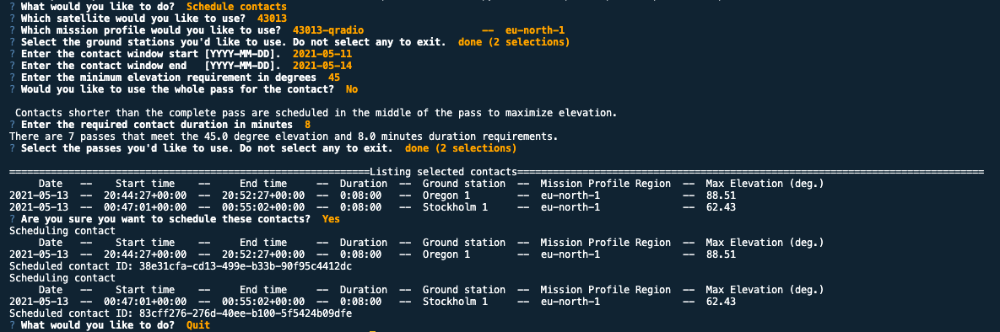
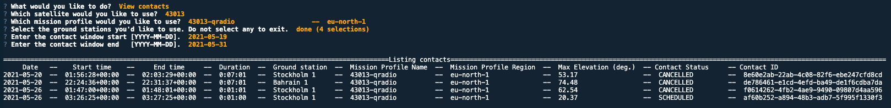
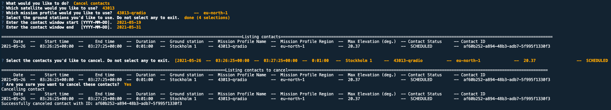

# AWS Ground Station CLI Contact Control Utility 

##  Solution overview

This repo contains an interactive CLI utility for scheduling AWS Ground Station satellite contacts. Manually navigating the AWS Ground Station CLI is somewhat clunky, so this tool aims to streamline the process. Furthermore, it expands on the functionality available in the AWS Ground Station web console by: 
- scheduling/canceling multiple contacts at the same time
- filtering contacts based on maximum elevation
- scheduling contacts with precise duration 

 
The utility can:
1. Schedule contacts with elevation and duration requirements
2. Show contacts of the following types:
    "SCHEDULED", "SCHEDULING", "FAILED_TO_SCHEDULE", "AWS_CANCELLED", "CANCELLED", COMPLETED", "FAILED", "AWS_CANCELLED", "AWS_FAILED", "CANCELLED", "FAILED_TO_SCHEDULE"
3. Cancel scheduled contacts

Contacts with duration shorter than the whole craft pass are scheduled in the middle of the pass to maximize craft elevation.

The tool uses default AWS CLI credentials stored in the /.aws folder
Learn how to set up your AWS CLI: https://docs.aws.amazon.com/cli/latest/userguide/cli-chap-welcome.html 

NB: Canceling on demand contacts incurs their full cost! 

The utility uses the python SDK to call the AWS Ground Station API. It can serve as an example to customers that want to integrate AWS Ground Station contact scheduling into their mission control offerings.


boto3 GroundStation reference: https://boto3.amazonaws.com/v1/documentation/api/latest/reference/services/groundstation.html

## Usage examples 

Install the required Python modules 

```bash
pip3 install -r requirements.txt    
```


Run the utility and follow the on screen instructions. 

```bash
python3 contact-control.py     
```

### Known dependancy issue

```bash
File "/opt/homebrew/lib/python3.11/site-packages/prompt_toolkit/styles/from_dict.py", line 9, in <module>
    from collections import Mapping
ImportError: cannot import name 'Mapping' from 'collections'
```

If you get the above error from the collections library you have to do the following:
1. `nano /opt/homebrew/lib/python3.11/site-packages/prompt_toolkit/styles/from_dict.py` 
2. Change collections import statement from `from collections import Mapping` to `from collections.abc import Mapping`
3. Save and quit

### Scheduling contacts 




### Viewing contacts




### Canceling contacts



